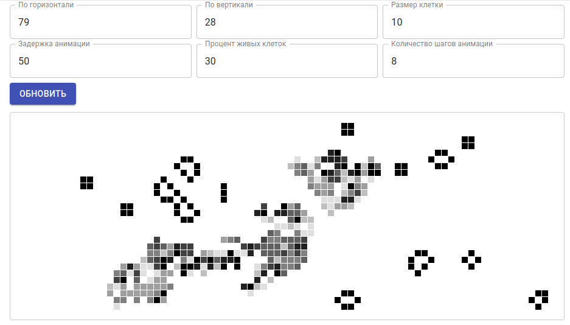

# OTUS React JS Final Project

https://github.com/shurupov/otus-react-project

### Это репозиторий проектной работы курса React JS в школе Otus

##### Тема работы: Клеточный автомат "Игра "Жизнь" (Жизнь Конвея)

##### Презентации:

[ODP презентация](Presentation.odp)

[Google Slides презентация](https://docs.google.com/presentation/d/e/2PACX-1vTtJpjPjNmKIxW-hrjlhar5itVQp9TIDhgWIeRgmNBsOxbP8_7T2sqGwv46koQfH1fmTXrsJZuAtO9F/pub?start=false&loop=false&delayms=3000)

##### Используемые технологии:

1. Babel, Webpack, TypeScript, loki, Jest
2. ReactJS, JSX, Storybook, Emotion, Enzyme, material-ui
3. Redux, Saga, redux-saga-test-plan
4. ReactRouter
5. Express, pupeteer/NextJS (SSR)

##### Способы запуска:

Установить все пакеты:
`npm install`

Запустить в dev-mode:
`npm start`

Собрать и запустить в prod-mode:
`npm build && npm run start:prod`

Запустить storybook с компонентами:
`npm run storybook`

Прогнать unit-тесты:
`npm run test`

Собрать данные о покрытии тестами:
`npm run coverage`

Прогнать unit-тесты и snapshot-тесты
`npm run check`
